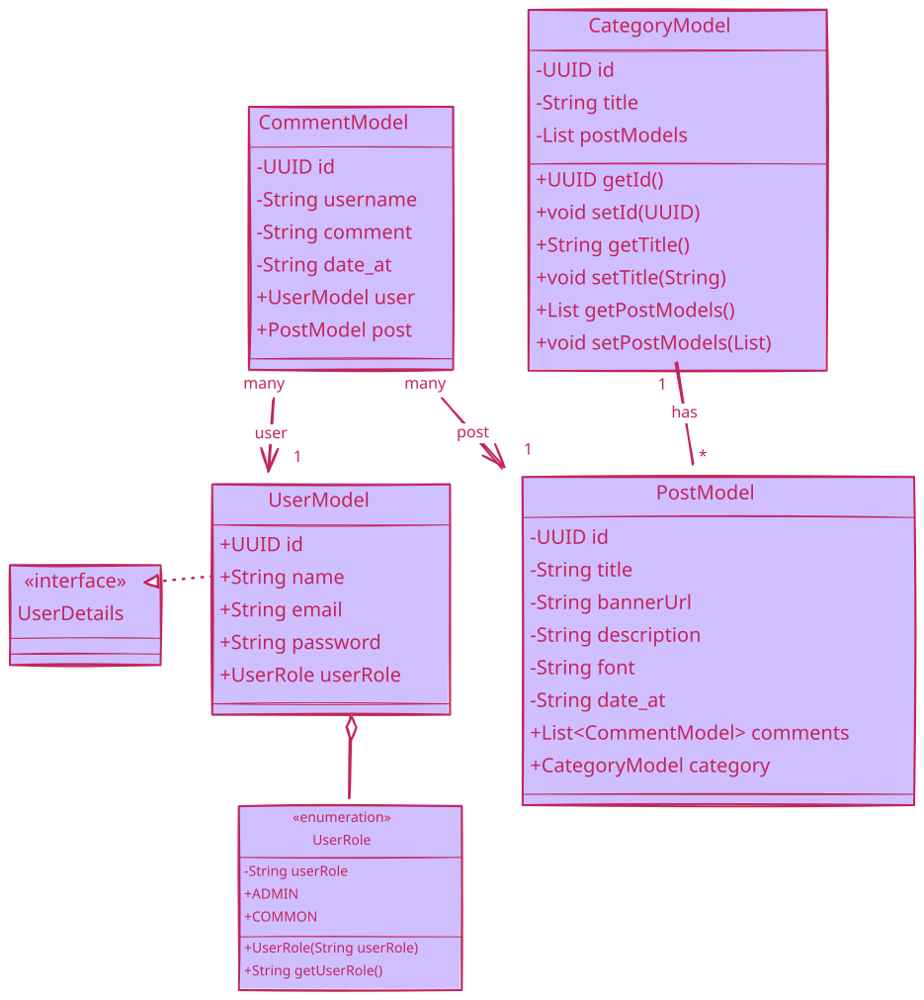

#
<div align="center">
    
</div>

#


## Objetivo
TechDecode API é uma api rest que disponibiliza, para consumo, noticias sobre tecnologia.

## Modo de uso
```shell
git clone https://github.com/Faguim02/Tech-Decode-Api-Java
```
No diretorio do projeto:
```shell
mvn clean package
mvn install
java -jar target/*.jar
```
acesse no navegador para sober como usar as rotas:\
`http://localhost:8080/swagger-ui.html`
\
ou acesse: \
[Click aqui para seguir os passos](./markdown/UseApi.md).

## Como posso contribuir com o projeto
O projeto é livre para que qualquer tipo de contribuição seja bem vinda.
Caso tenho vontande em contribuir com o projeto
[Click aqui para seguir os passos](./markdown/Contribuir.md).

## Tecnologias utilizadas
- Java 17
- Postgresql 17
- SpringBoot
- - Data JPA
- - Web
- - Security
- - Auth 2.0 + jwt
- JUnit
- Mockito
- Aws S3

## Diagrama de classes


